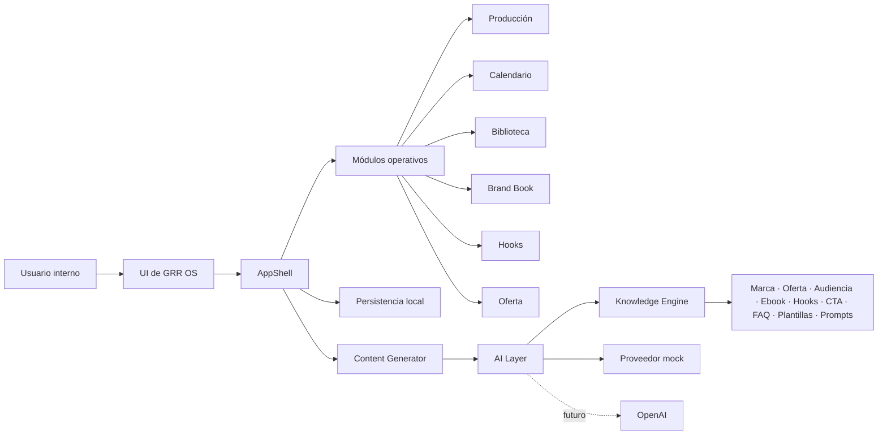
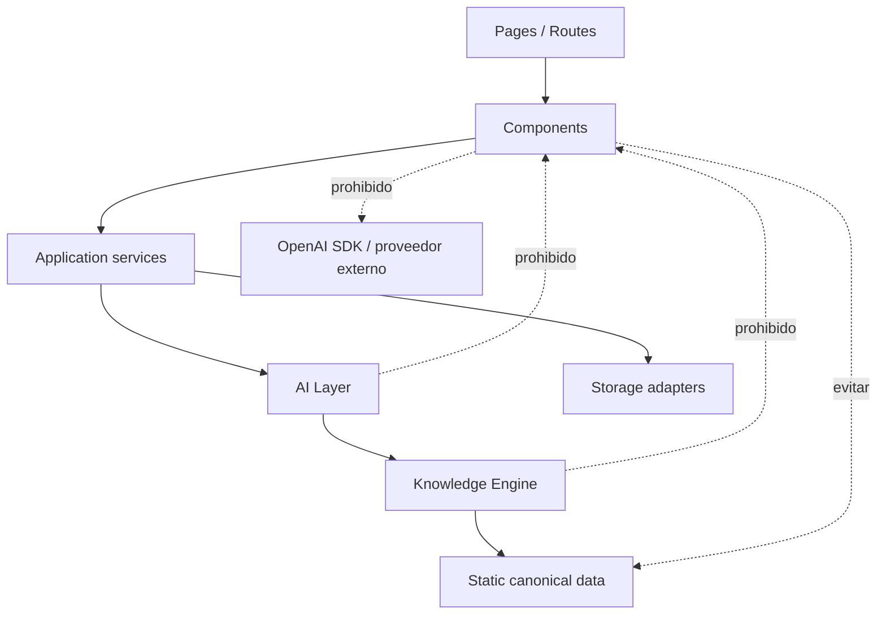
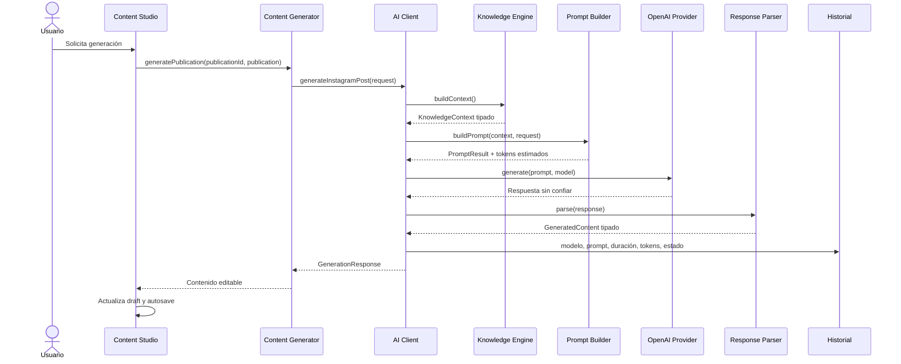

# GRR OS Master Plan v1.0

> Documento oficial de arquitectura y evolución de Guía Restaurante Rentable (GRR OS).
>
> Estado del documento: vigente  
> Versión: 1.1  
> Fecha de referencia: 15 de julio de 2026  
> Alcance auditado: código disponible en `src/`, configuración del proyecto y documentación raíz.

## Índice

1. [Visión del producto](#1-visión-del-producto)
2. [Objetivos](#2-objetivos)
3. [Arquitectura general](#3-arquitectura-general)
4. [Estructura de carpetas](#4-estructura-de-carpetas)
5. [Principios de arquitectura](#5-principios-de-arquitectura)
6. [Convenciones](#6-convenciones)
7. [Flujo de inteligencia artificial](#7-flujo-de-inteligencia-artificial)
8. [Roadmap](#8-roadmap)
9. [Definition of Done](#9-definition-of-done)
10. [Filosofía del proyecto](#10-filosofía-del-proyecto)
11. [Reglas para futuras implementaciones](#11-reglas-para-futuras-implementaciones)
12. [Estado actual del proyecto](#12-estado-actual-del-proyecto)
13. [Riesgos técnicos](#13-riesgos-técnicos)
14. [Métricas del proyecto](#14-métricas-del-proyecto)
15. [Gobierno y mantenimiento de este documento](#15-gobierno-y-mantenimiento-de-este-documento)

---

## 1. Visión del producto

### 1.1 Qué es GRR OS

GRR OS es el sistema operativo interno de contenido de **Guía Restaurante Rentable**. Centraliza el conocimiento de la marca y el flujo necesario para planificar, producir, publicar y medir contenido educativo dirigido a personas que quieren abrir u operar un restaurante rentable en Estados Unidos.

No es solo un calendario editorial ni una colección de formularios. Su propósito es convertir conocimiento de negocio en decisiones y piezas de contenido consistentes, trazables y reutilizables.

### 1.2 Problema que resuelve

La producción de contenido suele fragmentarse entre documentos, notas, hojas de cálculo, herramientas de diseño y conocimiento tácito. Esto provoca:

- Mensajes inconsistentes con la marca y la oferta.
- Duplicación de datos y trabajo.
- Pérdida de contexto entre idea, guion, diseño, publicación y resultados.
- Dificultad para producir temporadas completas de manera sistemática.
- Dependencia de una persona para recordar reglas, CTA, tono y prioridades.

GRR OS reúne ese ciclo en un solo entorno y convierte el Brand Book y el Knowledge Engine en contexto operativo.

### 1.3 Usuario principal

El usuario principal es el equipo interno de Guía Restaurante Rentable: fundador, estratega de contenido, redactor, diseñador, editor y responsable de publicación. En su etapa actual, la aplicación está optimizada para operación interna y persistencia local, no para colaboración multiusuario.

La audiencia final del contenido son emprendedores y operadores hispanohablantes que quieren abrir, administrar o mejorar un restaurante en Estados Unidos.

### 1.4 Diferenciadores

- **Conocimiento centralizado:** marca, oferta, audiencia, ebook, hooks, CTA, FAQ, plantillas y prompts comparten una fuente tipada.
- **Producción con contexto:** cada publicación mantiene estrategia, contenido, diseño, publicación, checklist y métricas.
- **Continuidad editorial:** Kanban, Lista y Studio representan distintas vistas del mismo inventario.
- **IA gobernada:** la generación se prepara desde el conocimiento oficial, no desde prompts aislados dentro de componentes.
- **Trazabilidad:** autosave, historial editorial y futuro historial de generación permiten reconstruir decisiones.

---

## 2. Objetivos

### 2.1 Corto plazo: sprints 6 a 8

- Conectar OpenAI a través de la AI Layer, sin acceso directo desde React.
- Sustituir respuestas simuladas por generación real validada y observable.
- Mantener el Knowledge Engine como contexto obligatorio de cada generación.
- Mejorar la experiencia de edición sin romper el modelo de datos ni las rutas.
- Añadir pruebas automatizadas sobre rutas y flujos críticos.

### 2.2 Mediano plazo: sprints 9 a 12

- Generar y administrar recursos visuales desde el flujo de producción.
- Automatizar programación y publicación con controles de aprobación.
- Incorporar analítica que conecte contenido, alcance, conversiones y ventas.
- Añadir un asistente conversacional con acceso controlado al conocimiento de GRR.
- Reducir gradualmente el tamaño y las responsabilidades de `AppShell`.

### 2.3 Largo plazo

- Convertir GRR OS en una plataforma operativa multiusuario y auditable.
- Persistir contenido, historial y configuración en una base de datos central.
- Orquestar contenido multicanal para Instagram, Facebook, LinkedIn, email y páginas de conversión.
- Automatizar tareas repetitivas sin retirar la aprobación humana de decisiones sensibles.
- Medir qué conocimiento, formato y mensaje contribuyen a crecimiento e ingresos.

---

## 3. Arquitectura general

### 3.1 Tecnologías actuales

| Área | Tecnología | Estado |
|---|---|---|
| Framework | Next.js 15 con App Router | Activo |
| UI | React 19 + TypeScript estricto | Activo |
| Estilos | Tailwind CSS 3 | Activo |
| Persistencia | `localStorage` | Activo, solo cliente |
| Datos canónicos | Knowledge Engine tipado | Activo |
| IA | Cliente central y proveedor mock | Activo |
| OpenAI | Proveedor server-side mediante Responses API | Activo cuando existe `OPENAI_API_KEY`; fallback mock en caso contrario |
| Backend y autenticación | No implementados | Pendiente |
| Pruebas automatizadas | No existe suite dedicada | Pendiente |

### 3.2 Mapa de alto nivel



### 3.3 Capas y responsabilidades

#### UI y App Router

`src/app/` define las rutas públicas. Las páginas son adaptadores delgados que pasan el modo inicial y el identificador de publicación a `AppShell`.

Rutas actuales:

| Ruta | Responsabilidad |
|---|---|
| `/` | Dashboard y módulos internos seleccionados desde la navegación. |
| `/produccion` | Entrada al módulo de Producción. |
| `/produccion/kanban` | Vista Kanban de Producción. |
| `/produccion/lista` | Vista Lista de Producción. |
| `/produccion/studio/[id]` | Studio de una publicación concreta. |
| `POST /api/ai/generate` | Generación server-side con proveedor intercambiable y fallback. |

#### AppShell

`src/app/AppShell.tsx` es actualmente el orquestador principal del cliente. Administra navegación interna, estados de los módulos, persistencia local y la mayor parte de la UI. Esta concentración explica la velocidad de desarrollo inicial, pero no es la arquitectura objetivo para el crecimiento de largo plazo.

#### Knowledge Engine

`src/lib/knowledge/` concentra conocimiento estático y expone `getKnowledgeContext()` como interfaz agregada. Cada repositorio de datos conserva una responsabilidad específica y `index.ts` funciona como punto público de acceso.

El contexto incluye:

- Marca y audiencia.
- Oferta.
- Ebook, capítulos, plantillas y calculadoras.
- Hooks.
- CTA.
- FAQ.
- Plantillas editoriales.
- Prompts y frameworks.
- Pilares y catálogos operativos.

#### AI Layer

`src/lib/ai/` encapsula modelos, construcción de prompts, validación de respuestas, estimación de tokens, errores e historial en memoria. La ruta interna usa un registro de proveedores y un cliente OpenAI singleton; `index.ts` continúa como punto de entrada público para contratos seguros en cliente.

La UI no importa SDK, credenciales ni implementaciones de proveedor. `contentGenerator.ts` llama exclusivamente a la API interna. El servidor selecciona OpenAI cuando está configurado y reutiliza el mock existente ante credenciales ausentes, timeout, error transitorio o respuesta inválida.

#### Módulos operativos

- **Producción:** gestiona temporada, filtros, Kanban, Lista, Studio, estados y checklist.
- **Content Studio:** edita estrategia, copy, diseño, programación y métricas; ofrece preview, autosave e historial.
- **Calendario:** organiza piezas por fecha y vistas temporales.
- **Biblioteca:** administra inventario general de contenido.
- **Brand Book y Marca:** conservan referencias editoriales y de identidad.
- **Hooks y Guiones:** reúnen activos reutilizables.
- **Oferta:** documenta producto y embudo.
- **Analítica:** agrega resultados del contenido publicado.

### 3.4 Dependencias permitidas



Regla de dirección: una capa de negocio no puede depender de una capa visual. Los datos y servicios no importan componentes React.

### 3.5 Estado actual frente a arquitectura objetivo

| Tema | Estado actual | Dirección obligatoria |
|---|---|---|
| Orquestación UI | Concentrada en `AppShell` | Extraer por dominio de forma incremental. |
| Datos de marca | Knowledge Engine + estado editable local | Definir sincronización entre conocimiento canónico y edición persistida. |
| Producción inicial | `productionData.ts` | Migrar a repositorio o servicio cuando exista backend. |
| Persistencia | Claves de `localStorage` | Adaptador con implementación local y futura implementación remota. |
| IA | OpenAI server-side con fallback mock | Añadir Claude o Gemini mediante el mismo contrato de proveedor. |
| Historial IA | Memoria de proceso | Persistencia auditable por usuario y publicación. |
| Rutas no productivas | Vistas internas desde `/` | Mantener compatibilidad; crear rutas solo mediante sprint explícito. |

---

## 4. Estructura de carpetas

### 4.1 Árbol actual relevante

```text
.
├── docs/
│   └── GRR_OS_MASTER_PLAN.md
├── src/
│   ├── app/
│   │   ├── AppShell.tsx
│   │   ├── globals.css
│   │   ├── layout.tsx
│   │   ├── page.tsx
│   │   ├── api/ai/generate/route.ts
│   │   └── produccion/
│   │       ├── page.tsx
│   │       ├── kanban/page.tsx
│   │       ├── lista/page.tsx
│   │       └── studio/[id]/page.tsx
│   ├── components/
│   │   └── production/
│   │       ├── CharacterCounter.tsx
│   │       ├── Checklist.tsx
│   │       ├── EditorSection.tsx
│   │       ├── HistoryPanel.tsx
│   │       └── InstagramPreview.tsx
│   └── lib/
│       ├── ai/
│       ├── knowledge/
│       ├── brandBookData.ts
│       ├── productionData.ts
│       ├── storage.ts
│       └── types.ts
├── next.config.ts
├── tailwind.config.ts
├── tsconfig.json
├── package.json
├── README.md
└── PLAN.md
```

### 4.2 Responsabilidad por carpeta

| Ruta | Responsabilidad |
|---|---|
| `docs/` | Arquitectura, roadmap, decisiones y normas permanentes. |
| `src/app/` | Rutas, layout y composición de vistas de Next.js. |
| `src/components/` | Componentes React reutilizables y específicos de dominio. |
| `src/lib/knowledge/` | Fuente canónica tipada del conocimiento de GRR. |
| `src/lib/ai/` | Casos de generación, prompts, proveedores, parsing, uso y errores. |
| `src/lib/storage.ts` | Persistencia local y exportación de archivos. |
| `src/lib/types.ts` | Tipos de dominio compartidos por la aplicación. |
| `src/lib/brandBookData.ts` | Datos iniciales actuales del Brand Book. |
| `src/lib/productionData.ts` | Inventario y configuración iniciales de Producción. |

### 4.3 Responsabilidad de la AI Layer

| Archivo | Responsabilidad |
|---|---|
| `client.ts` | Orquestar todos los tipos de generación. |
| `models.ts` | Registrar modelos disponibles y modelo predeterminado. |
| `promptBuilder.ts` | Construir prompts a partir de contexto y solicitud. |
| `responseParser.ts` | Validar y normalizar salidas no confiables. |
| `tokenCounter.ts` | Estimar uso de tokens sin dependencia externa. |
| `generationHistory.ts` | Registrar temporalmente generaciones. |
| `errors.ts` | Normalizar errores del dominio IA. |
| `knowledgeProvider.ts` | Adaptar el Knowledge Engine a la AI Layer. |
| `contentGenerator.ts` | Mantener el contrato de generación usado por Producción. |
| `mockResponses.ts` | Implementar respuestas simuladas centralizadas. |
| `openaiProvider.ts` | Adaptador de compatibilidad hacia el cliente OpenAI singleton. |
| `openaiClient.ts` | Cliente singleton de Responses API, timeout y reintentos. |
| `providerRegistry.ts` | Resolver proveedores sin acoplar la ruta a OpenAI. |
| `fallback.ts` | Adaptar el generador mock actual al contrato estructurado. |
| `types.ts` | Contratos TypeScript de IA. |
| `index.ts` | API pública del módulo. |

### 4.4 Responsabilidad del Knowledge Engine

| Archivo | Responsabilidad |
|---|---|
| `brand.ts` | Marca, audiencia y pilares. |
| `offer.ts` | Producto, precio, garantía, beneficios y promesa. |
| `ebook.ts` | Libro, capítulos, subcapítulos, plantillas y calculadoras. |
| `hooks.ts` | Catálogo y contexto de hooks. |
| `ctas.ts` | CTA principal y catálogo oficial. |
| `faq.ts` | Preguntas y respuestas de la oferta. |
| `templates.ts` | Plantillas, contenido inicial y catálogos editoriales. |
| `prompts.ts` | Frameworks y plantillas conceptuales de prompts. |
| `types.ts` | Contratos del conocimiento. |
| `index.ts` | Agregador `getKnowledgeContext()` y exportaciones públicas. |

---

## 5. Principios de arquitectura

1. **Una sola fuente de verdad.** Cada dato canónico debe tener un propietario claro. Marca, oferta y audiencia pertenecen al Knowledge Engine.
2. **No duplicar lógica.** Las reglas compartidas se extraen a una función o servicio del dominio que las posee.
3. **Separar UI y negocio.** Los componentes representan estado y eventos; los servicios ejecutan reglas, persistencia e integraciones.
4. **Toda IA pasa por la AI Layer.** Ningún componente React debe conocer proveedores, SDK, claves, modelos externos o formato crudo de respuesta.
5. **Validar límites no confiables.** Toda salida de IA, dato remoto o dato persistido debe validarse antes de entrar al dominio.
6. **Tipado fuerte.** No usar `any` para evitar diseñar un contrato. Preferir uniones discriminadas, tipos de dominio y `unknown` en límites externos.
7. **Compatibilidad hacia atrás.** Refactors internos deben preservar rutas, claves persistidas y contratos públicos salvo migración explícita.
8. **Componentes pequeños y cohesivos.** Un componente debe tener una razón principal para cambiar.
9. **Dependencias dirigidas hacia el dominio.** UI depende de servicios; servicios pueden depender de conocimiento; el conocimiento no depende de UI.
10. **Complejidad justificada.** No añadir capas, librerías o abstracciones sin un problema actual y medible.
11. **Aprobación humana.** La IA propone; el usuario revisa y aprueba antes de publicar o ejecutar acciones externas.
12. **Observabilidad desde el inicio.** Toda generación real deberá registrar duración, modelo, tokens, estado y referencia de la publicación.

---

## 6. Convenciones

### 6.1 Archivos y carpetas

- Componentes React: `PascalCase.tsx`.
- Módulos, servicios y utilidades: `camelCase.ts`.
- Rutas: convención de Next.js App Router con `page.tsx` y segmentos en minúscula.
- Tipos de un módulo: `types.ts` cuando son internos; tipos transversales en `src/lib/types.ts`.
- Puntos de entrada públicos: `index.ts` con exportaciones explícitas.
- No crear archivos `utils.ts` genéricos; nombrar por responsabilidad, por ejemplo `tokenCounter.ts`.

### 6.2 Componentes

- Nombre en `PascalCase` y exportación con el mismo nombre.
- Props tipadas y orientadas a intención: datos, callbacks y estado controlado.
- No leer mocks, `localStorage` ni proveedores externos directamente desde componentes nuevos.
- Mantener lógica de presentación sencilla; extraer reglas de negocio repetidas.
- Reutilizar el lenguaje visual y clases existentes salvo sprint de diseño.

### 6.3 Hooks

- Hooks reutilizables en `src/hooks/` cuando exista más de un consumidor o encapsulen un ciclo de vida complejo.
- Nombres con prefijo `use`, por ejemplo `useAutosave`.
- No ocultar llamadas a proveedores dentro de hooks visuales; consumir servicios públicos.
- Dependencias de efectos completas y estables. Evitar efectos que reescriban el estado que observan sin condición de salida.

### 6.4 Servicios y utilidades

- Una responsabilidad por archivo.
- Funciones puras para transformación y cálculo siempre que sea posible.
- Efectos externos en adaptadores explícitos: almacenamiento, red, descargas o publicación.
- Errores del dominio centralizados y normalizados antes de llegar a la UI.

### 6.5 Tipos

- Interfaces para contratos extensibles; aliases para uniones y composiciones.
- Valores de estado como uniones literales, no `string` abierto cuando el catálogo es conocido.
- Las respuestas de proveedores entran como `unknown` y pasan por parser.
- Las API públicas deben declarar tipos de entrada y salida.
- Evitar duplicar conceptos con nombres distintos. Antes de crear un tipo, buscar el equivalente existente.

### 6.6 Imports

- Usar alias `@/` para módulos dentro de `src/`.
- Preferir la API pública `@/lib/ai` y `@/lib/knowledge` para consumidores nuevos.
- Los imports internos de un mismo módulo pueden usar rutas relativas.
- No importar archivos de datos internos desde React cuando exista un repositorio o servicio público.

### 6.7 Persistencia y migraciones

- Toda clave persistida debe ser constante, estable y documentada.
- Cambios incompatibles de esquema requieren versión y migración, nunca borrado silencioso.
- El fallback debe permitir arrancar ante datos ausentes o corruptos.
- Las fechas persistidas usan ISO 8601; la localización ocurre solo al renderizar.

---

## 7. Flujo de inteligencia artificial

### 7.1 Flujo objetivo



### 7.2 Flujo vigente

El flujo actual recorre todas las capas mediante `POST /api/ai/generate`. Con `OPENAI_API_KEY`, el servidor usa Responses API y Structured Outputs; sin clave o ante un fallo controlado, devuelve el mock actual con el mismo contrato y registra `fallbackUsed`.

### 7.3 Contratos mínimos

- `GenerationRequest`: tipo de generación, publicación, objetivo, pilar, instrucciones y modelo.
- `KnowledgeContext`: conocimiento completo y tipado de GRR.
- `PromptResult`: mensajes del sistema y usuario, prompt combinado y tokens estimados.
- `GenerationResponse<T>`: salida tipada, modelo, uso, duración, estado y fecha.
- `GenerationHistoryItem`: registro resumido de cada intento.

### 7.4 Reglas para OpenAI

- La clave nunca se expone al cliente ni se almacena en el repositorio.
- La llamada debe ejecutarse en servidor mediante una ruta o acción controlada.
- El proveedor implementa un contrato intercambiable; no modifica componentes.
- Usar salida estructurada y parser aun cuando el proveedor prometa JSON.
- Definir timeout, cancelación, reintentos limitados y clasificación de errores.
- Registrar modelo y uso real devuelto por el proveedor.
- No registrar secretos ni datos sensibles en prompts o errores.
- Incorporar límites de costo, longitud y concurrencia antes de habilitar producción.

### 7.5 Punto de extensión para Sprint 6.1

Sprint 6.1 puede añadir proveedores alternativos implementando `AIProviderClient` y registrándolos sin cambiar la ruta ni la UI:

```text
AI Client
├── mock provider        # desarrollo y fallback controlado
├── OpenAI provider      # activo
├── Anthropic provider   # futuro
└── Google provider      # futuro
```

---

## 8. Roadmap

### Sprint 6: conexión OpenAI — completado

- Proveedor server-side implementado mediante API interna.
- Secretos preparados por entorno y nunca expuestos al cliente.
- Contrato y registro de proveedores implementados.
- Timeouts, reintentos, errores seguros y uso de tokens implementados.
- Fallback mock explícito y compatible implementado.

### Sprint 7: generación real de contenido

- Generar hooks, copy, CTA, hashtags y prompts visuales reales.
- Aplicar validación estructurada y revisión humana.
- Añadir estados de carga, error y reintento sin alterar datos guardados.
- Evaluar calidad con un conjunto fijo de publicaciones.

### Sprint 8: editor enriquecido

- Introducir bloques de edición enriquecida con compatibilidad de datos.
- Mejorar versionado, deshacer y comparación de cambios.
- Extraer responsabilidades del Studio sin cambiar sus rutas.

### Sprint 9: generación de imágenes

- Incorporar un proveedor de imágenes detrás de la AI Layer.
- Administrar prompts, referencias, variantes y recursos finales.
- Definir almacenamiento, formatos y derechos de uso.

### Sprint 10: publicación automática

- Integrar canales mediante adaptadores.
- Separar programación, aprobación y publicación.
- Hacer cada operación idempotente y auditable.
- Mantener confirmación humana antes del envío.

### Sprint 11: analítica

- Persistir métricas por publicación y canal.
- Normalizar alcance, interacción, CTR, conversión e ingresos.
- Relacionar resultados con pilar, formato, hook, CTA y campaña.

### Sprint 12: asistente IA conversacional

- Consultar Knowledge Engine y datos autorizados del sistema.
- Ejecutar herramientas mediante permisos explícitos.
- Conservar trazabilidad de fuentes y acciones.
- Separar conversación, razonamiento de aplicación y mutaciones.

### Temas transversales

Autenticación, base de datos, almacenamiento de assets, pruebas automatizadas y observabilidad no deben posponerse indefinidamente. Cada sprint debe incorporar la parte mínima necesaria para que la nueva capacidad sea operable y segura.

---

## 9. Definition of Done

Un sprint solo está terminado cuando cumple todos los puntos aplicables.

### 9.1 Calidad técnica

- `pnpm build` finaliza con código 0.
- `pnpm dev` inicia sin errores.
- TypeScript no presenta errores.
- ESLint no presenta errores ni warnings relevantes.
- No se instalan o actualizan dependencias fuera del alcance aprobado.
- No quedan logs temporales, placeholders de depuración ni código muerto introducido por el sprint.

### 9.2 Compatibilidad

- `/`, `/produccion`, `/produccion/kanban`, `/produccion/lista` y rutas Studio siguen funcionando.
- La navegación existente no contiene destinos rotos.
- No hay pantallas blancas ni errores de hidratación.
- La UI permanece intacta salvo requisito explícito.
- Los datos persistidos antes del cambio siguen siendo legibles o cuentan con migración.

### 9.3 Verificación funcional

- Se prueban los flujos afectados en navegador, no solo mediante compilación.
- Autosave e historial siguen funcionando cuando se modifica Producción.
- La generación no sobrescribe contenido ante un error parcial.
- Estados vacíos, identificadores inexistentes y datos incompletos fallan de forma segura.
- La consola del navegador no contiene errores nuevos.

### 9.4 Arquitectura y entrega

- El cambio respeta las dependencias permitidas de este documento.
- No duplica datos, tipos o lógica existente.
- Los contratos públicos modificados están documentados.
- Se reportan archivos creados y modificados, validaciones y decisiones técnicas.
- Este Master Plan se actualiza si cambia una decisión arquitectónica, un módulo o el roadmap.

---

## 10. Filosofía del proyecto

GRR OS prioriza:

- **Arquitectura limpia:** responsabilidades y límites reconocibles.
- **Escalabilidad:** crecer sin multiplicar dependencias implícitas.
- **Bajo acoplamiento:** sustituir almacenamiento o proveedores sin rehacer la UI.
- **Reutilización:** compartir contratos y comportamiento con intención.
- **Tipado fuerte:** convertir supuestos en contratos verificables.
- **Mantenibilidad:** optimizar para el próximo desarrollador, no solo para el sprint actual.
- **Rendimiento:** medir antes de optimizar y evitar trabajo innecesario en cliente.
- **Simplicidad:** elegir la solución más pequeña que preserve claridad y evolución.
- **Calidad editorial:** la automatización debe reforzar la voz y credibilidad de la marca.
- **Control humano:** ninguna automatización externa importante debe ser irreversible o invisible.

La sofisticación del sistema debe concentrarse en resolver problemas reales. Una abstracción es valiosa cuando reduce duplicación, riesgo o acoplamiento; no por existir.

---

## 11. Reglas para futuras implementaciones

### 11.1 Antes de modificar código

1. Leer este documento y la especificación del sprint.
2. Auditar los archivos y contratos relacionados.
3. Buscar implementaciones existentes con `rg` antes de crear código.
4. Identificar rutas, claves de almacenamiento y consumidores afectados.
5. Separar hechos actuales, supuestos y decisiones nuevas.
6. Definir cómo se verificará el cambio antes de editar.

### 11.2 Durante la implementación

- Reutilizar servicios y tipos existentes.
- Extender APIs públicas en lugar de crear accesos paralelos.
- Mantener cambios pequeños y dentro del dominio solicitado.
- No modificar UI, navegación o estilos si el sprint no lo requiere.
- No introducir dependencias sin justificación y aprobación.
- Preservar compatibilidad hacia atrás.
- No acceder a mocks desde componentes React.
- No acceder a OpenAI fuera de la AI Layer.
- No leer conocimiento canónico desde copias locales ad hoc.
- Añadir validación en límites externos.

### 11.3 Antes de finalizar

- Revisar el diff o inventario exacto de cambios.
- Ejecutar build y las verificaciones solicitadas.
- Probar las rutas y flujos afectados.
- Confirmar que no se alteraron áreas restringidas.
- Eliminar instrumentación temporal.
- Actualizar documentación cuando la arquitectura real cambie.

### 11.4 Decisiones que requieren un sprint explícito

- Cambiar rutas públicas o navegación.
- Cambiar el esquema persistido.
- Añadir base de datos o autenticación.
- Instalar o actualizar dependencias.
- Cambiar tokens visuales, Tailwind o layout.
- Conectar un proveedor externo.
- Publicar contenido automáticamente.
- Dividir `AppShell` en módulos mayores.

---

## 12. Estado actual del proyecto

### 12.1 Módulos terminados y utilizables

- Dashboard con resumen editorial y métricas.
- Biblioteca de contenido.
- Calendario editorial.
- Producción con Kanban, Lista y filtros.
- Content Studio por publicación.
- Navegación anterior, siguiente y siguiente pendiente.
- Checklist y porcentaje de avance.
- Preview de Instagram por formato.
- Brand Book y documentación de marca.
- Biblioteca de hooks y plantillas de guion.
- Oferta y embudo.
- Analítica básica.

### 12.2 Infraestructura existente

- Next.js App Router con rutas reales para Producción.
- TypeScript en modo estricto.
- Tailwind con tokens de color propios.
- Persistencia mediante `localStorage`.
- Knowledge Engine tipado y agregado mediante `getKnowledgeContext()`.
- AI Layer con cliente central, modelos, prompts, parsers, errores, contador de tokens e historial en memoria.
- API interna `POST /api/ai/generate` como única frontera de generación desde React.
- Proveedor OpenAI server-side con Responses API, Structured Outputs, timeout y reintentos.
- Fallback mock para Instagram, carrusel, reel, story, CTA, email y landing.

### 12.3 Funcionalidades disponibles

- Crear y editar contenido.
- Mover publicaciones entre etapas.
- Buscar y filtrar Producción.
- Abrir publicaciones mediante rutas Studio estables.
- Guardar cambios y recargarlos desde almacenamiento local.
- Registrar historial editorial con fecha y hora.
- Generar contenido simulado utilizando contexto del Knowledge Engine.
- Mostrar contexto y prompt utilizados en el Studio.
- Exportar determinados datos y documentación.

### 12.4 Funcionalidades pendientes

- Configurar una API key válida y evaluar la calidad de generación real.
- Backend, base de datos y sincronización multiusuario.
- Autenticación y autorización.
- Persistencia durable del historial IA.
- Gestión real de archivos e imágenes.
- Publicación automática a canales.
- Analítica sincronizada con plataformas.
- Suite de pruebas unitarias, integración y E2E.
- Observabilidad centralizada y control de costos.
- Migración progresiva del monolito `AppShell` a límites de dominio.

### 12.5 Limitaciones conocidas

- Los datos son locales al navegador y dispositivo.
- El historial IA en memoria se pierde al recargar.
- La navegación de módulos no productivos vive principalmente dentro de `/`.
- `AppShell.tsx` concentra múltiples dominios y utilidades.
- Existen datos iniciales fuera del Knowledge Engine, especialmente Producción y Brand Book; no deben duplicarse al evolucionar sus repositorios.
- `README.md` y `PLAN.md` reflejan etapas anteriores y deben alinearse con este documento en un sprint documental futuro.

---

## 13. Riesgos técnicos

| Riesgo | Impacto | Probabilidad | Mitigación recomendada |
|---|---|---:|---|
| Crecimiento de `AppShell` | Regresiones, conflictos y dificultad de prueba | Alta | Extraer por dominio en sprints pequeños, preservando props y rutas. |
| Pérdida de datos en `localStorage` | Trabajo no compartido o irrecuperable | Alta | Diseñar repositorio de persistencia y migrar a backend con respaldo. |
| Dos fuentes entre datos canónicos y edición local | Contexto IA desactualizado | Media/Alta | Definir autoridad, sincronización y versionado de Brand Book/Knowledge. |
| Respuestas IA inválidas | Sobrescritura o contenido incompleto | Alta al conectar | Salida estructurada, parser, validación y actualización atómica. |
| Exposición de credenciales | Incidente de seguridad y costo | Media | OpenAI solo en servidor, secretos por entorno y rotación. |
| Costos o latencia impredecibles | Mala experiencia y gasto | Media | Límites por solicitud, modelos configurables, métricas y presupuestos. |
| Historial IA solo en memoria | Falta de auditoría | Alta | Persistir por publicación, usuario, prompt, modelo y versión. |
| Ausencia de pruebas automatizadas | Regresiones silenciosas | Alta | Empezar por funciones puras, rutas y flujo Studio crítico. |
| Evolución incompatible del almacenamiento | Pantallas blancas o pérdida de campos | Media | Versionar esquemas y ejecutar migraciones defensivas. |
| Automatización de publicación no idempotente | Duplicados públicos | Media | Claves idempotentes, estados transaccionales y confirmación humana. |
| Dependencia de un proveedor IA | Bloqueo o degradación | Media | Contrato de proveedor, selección configurable y fallback controlado. |
| Datos sensibles en logs/prompts | Riesgo de privacidad | Baja/Media | Política de datos, redacción y registros mínimos. |

### 13.1 Prioridades de mitigación

1. Proteger el límite server-side y los errores antes de conectar OpenAI.
2. Añadir pruebas del flujo de Producción y Studio.
3. Definir adaptador de persistencia antes de implementar colaboración.
4. Reducir `AppShell` gradualmente, sin una reescritura completa.
5. Resolver autoridad y sincronización entre Brand Book editable y Knowledge Engine.

---

## 14. Métricas del proyecto

### 14.1 Salud técnica

| Métrica | Definición | Objetivo inicial |
|---|---|---|
| Build exitoso | Porcentaje de builds principales con código 0 | 100% por sprint |
| Tiempo de build | Duración de `pnpm build` en entorno comparable | Registrar línea base; evitar regresión >20% |
| Errores TypeScript | Errores al finalizar sprint | 0 |
| Warnings relevantes | Warnings nuevos de aplicación o build | 0 |
| Regresiones de rutas | Rutas principales que dejan de responder | 0 |
| Errores de consola | Errores nuevos en flujos verificados | 0 |
| Defectos por sprint | Bugs confirmados posteriores a entrega | Tendencia descendente |

### 14.2 Calidad funcional

| Métrica | Definición | Objetivo inicial |
|---|---|---|
| Cobertura de flujos críticos | Flujos con prueba manual reproducible o automatizada | 100% de los afectados |
| Persistencia correcta | Ediciones que sobreviven recarga | 100% |
| Navegación válida | Tarjetas y acciones con destino correcto | 100% |
| Recuperación de error | Generaciones fallidas que no destruyen el draft | 100% |
| Tiempo de autosave | Tiempo entre cambio y confirmación persistida | <= 5 s |

### 14.3 Métricas IA futuras

| Métrica | Definición |
|---|---|
| Latencia de generación | Tiempo desde solicitud hasta respuesta validada. |
| Tasa de éxito | Respuestas parseadas y aceptadas / solicitudes totales. |
| Tokens por generación | Entrada, salida y total por tipo de contenido. |
| Costo por activo aprobado | Costo de IA dividido por piezas aprobadas. |
| Tasa de aceptación | Generaciones utilizadas sin regeneración completa. |
| Edición posterior | Magnitud de cambios entre generación y publicación. |
| Calidad de marca | Evaluación de tono, palabras prohibidas y CTA oficial. |

### 14.4 Métricas de producto

- Tiempo promedio desde idea hasta publicación.
- Publicaciones terminadas por semana.
- Porcentaje de temporada completada.
- Reutilización de hooks, CTA y plantillas.
- Rendimiento por pilar, formato y etapa del embudo.
- Alcance, guardados, compartidos, clics, ventas e ingresos atribuidos.

Las métricas deben tener línea base antes de establecer objetivos más estrictos. No se optimiza una cifra que todavía no se mide de forma consistente.

---

## 15. Gobierno y mantenimiento de este documento

### 15.1 Autoridad

Este archivo es la referencia arquitectónica principal de GRR OS. Cuando el código y el documento difieran, el sprint debe identificar la discrepancia y resolverla explícitamente: actualizar la implementación, actualizar el plan mediante una decisión aprobada o registrar la transición pendiente.

### 15.2 Cuándo actualizarlo

Actualizar este documento cuando ocurra alguno de estos cambios:

- Se crea, elimina o redefine un módulo.
- Cambia la dirección permitida entre capas.
- Se añade una integración o proveedor externo.
- Cambian rutas públicas, persistencia o contratos principales.
- Se completa o reordena un sprint del roadmap.
- Aparece un riesgo arquitectónico material.
- Cambia la Definition of Done.

### 15.3 Cómo actualizarlo

- Modificar solo las secciones afectadas.
- Actualizar versión y fecha de referencia.
- Distinguir estado actual de arquitectura objetivo.
- Evitar prometer como existente una función todavía planificada.
- Registrar decisiones duraderas con contexto, decisión y consecuencias.

### 15.4 Evolución documental recomendada

Mientras el proyecto sea compacto, este documento conserva visión, arquitectura, roadmap y reglas en una sola fuente. Cuando el historial de decisiones o las contribuciones crezcan, se recomienda dividir material operativo en:

- `docs/ARCHITECTURE.md`: arquitectura vigente y decisiones.
- `docs/ROADMAP.md`: planificación y estado de sprints.
- `docs/CONTRIBUTING.md`: flujo de trabajo y convenciones.

`GRR_OS_MASTER_PLAN.md` debe permanecer como índice y declaración de principios, enlazando esos documentos sin duplicar su contenido.

---

## Resumen ejecutivo para el siguiente sprint

GRR OS ya dispone de Knowledge Engine, API interna, AI Client, Prompt Builder, Response Parser, errores, modelos, historial y proveedor OpenAI server-side. El Sprint 6.1 debe validar calidad con una clave real y, si incorpora Claude o Gemini, hacerlo mediante `AIProviderClient` y `providerRegistry` sin modificar componentes.

Antes de habilitar generación real para usuarios, deben quedar definidos:

1. Contrato del proveedor y ubicación server-side.
2. Gestión de secretos por entorno.
3. Modelo, límites de tokens, timeout y presupuesto.
4. Esquema de salida y comportamiento ante parsing fallido.
5. Política de logging sin contenido sensible.
6. Prueba de regresión del flujo `Studio -> generar -> editar -> autosave -> recargar`.
